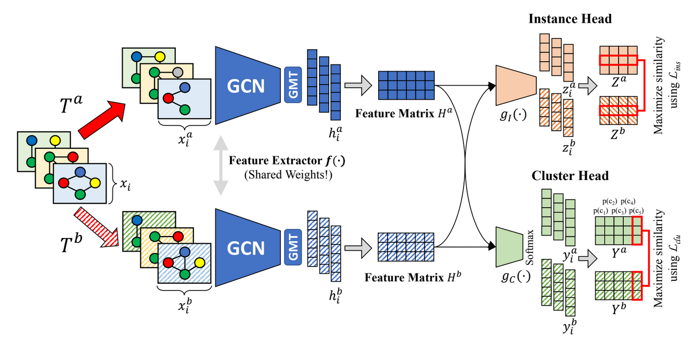

# Contrastive Graph-level Clustering

A deep learning approach for contrastive end-to-end representation learning and clustering of graph data. "Graph-level" refers to finding representations and clusters of whole graphs (i.e., molecules) and not single nodes in a graph. Put simply, this is an adaption of Contrastive Clustering ([Li et al. (AAAI 2021)](https://arxiv.org/abs/2009.09687), [GitHub](https://github.com/Yunfan-Li/Contrastive-Clustering)) for graph(-level) data. The ResNet used for image representation learning is replaced by a GNN for graph representation learning. The augmentations used for images are replaced by the augmentations for graphs introduced in GraphCL ([You et al. (NeurIPS 2020)](https://arxiv.org/abs/2010.13902), [GitHub](https://github.com/Shen-Lab/GraphCL)). The approach is visualized below:  

We generate two views of each graph of a batch by randomly applying one of the augmentations introduced in GraphCL to each view. Using a GCN, vector representations for both views are extracted. These are further mapped to instance and cluster representation spaces (interpretable as probabilities for the clusters), which are trained to be similar for positive pairs and dissimilar for negative pairs. For more details, we refer to the original Contrastive Clustering paper linked above.
## Installation
Tested on Ubuntu 20.04 with PyTorch 1.13.0 on Cuda 11.6, create a virtual environment and install:

    pip install torch==1.13.0+cu116 torchvision==0.14.0+cu116 torchaudio==0.13.0 --extra-index-url https://download.pytorch.org/whl/cu116
    pip install torch_geometric
    pip install pyg_lib torch_scatter torch_sparse torch_cluster torch_spline_conv -f https://data.pyg.org/whl/torch-1.13.0+cu116.html
    pip install ogb munkres pyyaml networkx

## Training

### Configuration
Model configuration can be configured in [config/config.yaml](config/config.yaml). The configuration includes:

#### General options
- seed: random seed for reproducibility
- dataset_dir: directory to save downloaded datasets (e.g., TUDatasets) to

#### Training options
- `batch_size`
- `start_epoch`: Usually 0, useful for resuming training starting at some epoch, only use when reload == True.
- `epochs`: Number of total epochs trained.
- `dataset`: Name of dataset loaded. See [config/config.yaml](config/config.yaml) for options. Add your own dataset in [datasetloader.DatasetLoader](datasetloader.DatasetLoader).
- `device`: Used device by PyTorch, e.g., "cpu" or "cuda".
- `used_loss`: "default" for using both heads "instanceonly" for only training instance head, "clusteronly" for only training cluster head.
- `checkpoint_interval`: At which interval models should be saved.

#### Augmentation settings for contrastive learning
- `augmode`: Options are: "default" "subgraphonly", "masknodesonly", "permuteedgesonly", "dropnodesonly", "noaug". Note: For each augmode (except noaug), there is a 20 % chance that no augmentation is applied to a view of the graph and the remaining 80 % are distributed uniformly among the aug options, i.e. when using  "default", there is a 20 % chance for each of the four augmentations, when using "dropnodesonly", there is an 80 % chance for node dropping being applied.
- `drop_nodes_ratio`: Percentage (0..1) of nodes to be dropped
- `subgraph_ratio`: Percentage (0..1) of nodes to be sampled.
- `permute_edges_ratio`: Percentage (0..1) of edges to be permuted.
- `mask_nodes_ratio`: Percentage (0..1) of nodes with masked features.

#### Model options
- `feature_dim`: Dimensionality of intermediate and final graph representations.
- `model_path`: Path to save the trained model to.
- `reload`: Set True together with the latest epoch as start_epoch if you want to restart training a model. 
- `n_clusters`: Options are -1 for inferring n_clusters from a given labeled dataset or a positive integer.
- `Custom model`: You may customize the used Model in [modules/gcn.py](modules/gcn.py) (GCN feature extractor) and [modules/network.py](modules/network.py) (instance and cluster heads). 

#### Loss options
- `learning_rate`, `weight_decay`, `instance_temperature`, `cluster_temperature`: See [Li et al.](https://arxiv.org/abs/2009.09687) for details.

### Training a model

To train a model with the configuration defined in [config/config.yaml](config/config.yaml), simply run  

    python train.py

## Inference

In [config/config.yaml](config/config.yaml), set `inference_epoch` to the checkpoint epoch you want to run inference on. Run  

    python inference.py

to iterate the dataset and save the soft clustering results to pickle file `clusters.pkl` and learned representations to `reps.pkl` in the directory `inference_save_path` defined in [config/config.yaml](config/config.yaml).

## Citation

If this work was useful in your research, consider citing it using

    @misc{ContrastiveGraphlevelClusteringDammann2022,
    author = {Michael Dammann},
    title = {Contrastive Graph-level Clustering},
    year = {2022},
    publisher = {GitHub},
    journal = {GitHub repository},
    howpublished = {\url{https://github.com/michaeldammann/Contrastive-GraphLevel-Clustering}}
    }